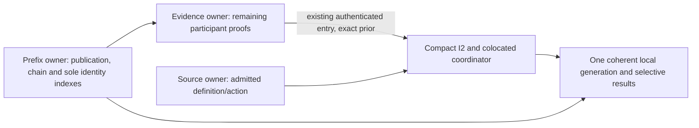

# Verified prefixes, compact authority and selective results

Use one private verifier owner for a pinned application prefix and its complete
or explicitly limited duplicate coverage. It stages an extension against the
exact accepted base. Keep this separate from the interpreted state, source,
authority and outcome frontier. Persist their references together in one local
generation before acknowledging durable local acceptance.

This successor preserves the [October 1 packet](2026-10-01-atseq-retry-prefix-boundary.md)
at `7aff44f01170b2832da6f2e1739277278538f8f8` unchanged. It adopts R1-1, R1-2 and
R1-3 from independent assessment `6e3d5811b02625ff3ad253b8de00f3c53f6854ff`,
ratified by `96af8911cb1dbb76b067effe3863c5692e23ca72`. It aligns with N1-D5's
frozen coordinator packet `85f0033e8c5d0ae636d5cc952c11a56baf9cc3f7` and independent
assessment `de72b10f847a00b9aaf562f15b36078bff287dbf`. These are source-only decisions;
implementation must still establish the named properties and pass exact-head review.

This note proposes the smallest complete joint P2/R1/P3 boundary. It does not
change the adopted native wire, random nonce, checkpoint or authority contracts.
The accompanying [expectation vectors](../experiments/post-spike-evidence/2026-10-02/retry-prefix-boundary/decision-vectors.json)
are review scenarios, not executed tests. No implementation, build, benchmark or
provider exercise was performed for this packet. Full P2, R1 and P3 remain open.

## Reuse the existing checks

The [retry decision](2026-10-01-atseq-retry-uniqueness.md) fixes exact unsigned
request CID lookup before `(app DID, genesis CID, canonical actor key, nonce)`
lookup. Nonces are exactly 16 random bytes. Principal, grant, epoch, operation
kind, execution contract and payload remain signed content. A valid alternate
low-S signature over the same intent is the same request; the first stored
signature and entry stay unchanged. Canonical decoding, target and signature
checks happen before retry lookup. Account operations instead use their complete
unsigned operation CID and consumed observation descriptor identity.

The [native wire note](2026-10-01-atseq-native-wire-contract.md) and
[incremental reader requirements](2026-10-01-atseq-incremental-reader-requirements.md)
fix selected-root membership, chain extension, immutable base binding, known
floors, prefix reuse and optional current-map audit. The
[materialization note](2026-10-01-atseq-materialized-checkpoints.md) fixes local
transaction, trusted restore and build provenance. The
[checkpoint policy](2026-10-01-atseq-checkpoint-policy-bytes.md) distinguishes
asserted completeness, deferred audit and independently established history.
Reuse these decisions rather than creating another proof or index protocol.

Approved main already has `verifyNativeEntryContents`, `nativeRetryIdentity`,
P1 authenticated repository capabilities, I1 binding checks, I2 authenticated
entry and authority capabilities, P4 history DATA validation and raw local
generations. The existing `log.RetryIndex`, host sequencer and browser outbox use
the earlier wire and do not implement this boundary.

## Separate publication verification from authority interpretation

`authenticateAuthorityEntry` currently requires a `NativeAuthorityState` prior
and calls `assertNativeAuthorityContext`. That combines publication checking
with the interpreted frontier and its duplicate arrays. It cannot verify an
entry after an activation has stalled interpretation.

Split the existing checks by responsibility, sharing helpers rather than
introducing a parallel verifier:

1. The prefix owner performs canonical content/signature checks, caller-accepted
   app binding, genesis/head/entry membership under one authenticated root and
   chain/index checks. For an authority observation, require the original
   app-native descriptor membership and exact typed context/subject binding.
   Stage its signed reference and referenced evidence inventory, without
   claiming that all nested participant proof or interpretation content has
   already been obtained. These checks use the existing wire, I1 and native
   proof owners; do not reproduce their canonical rules in an index class.
2. The evidence owner consumes the genuine prefix handle and exact next position,
   not caller-provided checked facts. Its internal read handoff supplies the
   privately checked original entry, request/entry CIDs, root/binding provenance
   and any already checked descriptor facts. It performs still-required
   participant binding, native proof and observation checks once, then mints the
   existing `AuthenticatedAuthorityEntry` capability. The producer checks that
   this entry extends the genuine interpreted prior; it does not repeat actor
   signatures or app membership. Shared already checked facts come from the
   private owner, not from a caller flag or serialized memo.
3. I2 consumes that authenticated-entry capability in order and evaluates
   authority using its recorded evidence. Grant scope, revocation, epoch,
   admission-floor and control precondition outcomes remain I2 decisions. It
   does not redo signatures, native membership or I1 proof authentication while
   folding. Its live state is compact: no request, retry or descriptor identity
   arrays. The prefix owner alone establishes that entry's uniqueness. Required
   source and activation evidence retain their own owners.

The existing authenticated-entry capability is justified by the real evidence
producer to interpreter handoff. The prefix capability is justified by verifier
to reader/writer/persistence handoffs. No additional published-entry brand is
needed: the evidence producer reads through the genuine prefix owner. Do not add
a brand for each map, pointer, status field or copied data projection. Neither
copied facts nor an error code may substitute for a genuine capability.

Missing verification-critical app paths, descriptor/context bytes or signatures
cannot advance the verified head. Complete publication/chain/index checks with
missing nested participant proof, source or other interpretation content may
advance the verified head while leaving the exact interpreted frontier stalled.
The retry and descriptor identities are consumed in that verified ordering;
this does not claim participant evidence acceptance or authority effectiveness.
This preserves the adopted authority-operation stall behavior.

An exposed structural/signature/chain/duplicate or invalid-evidence fault stops
promotion and fails closed. If invalid participant proof is exposed at position
p after the verified head has advanced beyond p, leave that verified ordering
head unchanged. All request, retry and descriptor identities through that head,
including p+1 onward, remain consumed. Their retained receipts remain
publication-only facts; neither those receipts nor the consumed identities
assert accepted participant evidence, effective authority or domain execution.
Record contradiction status at p and keep the interpreted frontier before p.
Stop further promotion/append readiness for that lineage, preserving every known
floor and contradiction; never turn the fault into a fold denial, lower the
verified head or release identities for reuse. Missing bytes, mismatching transport content and
local limits remain unavailable until exact evidence is obtained. Report what
was checked at each frontier; a verified ordering prefix is not a claim that
uninterpreted participant evidence passed. Follow PB1's observed-fault precedence
without guessing faults in unfetched bytes.

## One owner, fixed views and staged extensions

The internal prefix owner binds the external pin, supported semantic and
observation identities, exact accepted head, known floors, evidence provenance,
coverage and derived indexes. Callers receive a frozen opaque handle; private
owner state supplies all acceptance facts. Serialization and object cloning
cannot preserve it.

Use a single accepted chain lineage per owner. Keep private append-only indexed
rows, with immutable contents and original positions. Each prefix handle names a
fixed boundary and coverage. A lookup through an older handle ignores rows above
its boundary. New accepted rows therefore do not change that handle's logical
answers. A different branch cannot mutate the owner: reject an encountered
conflict under retained floors. A new genesis has a separate owner. Completing a
historical audit or changing prior coverage creates a separately validated owner
or view; do not backfill an old view into silently stronger assurance.

For an extension:

1. Capture the genuine base handle and current publication generation before
   asynchronous work. Authenticate one selected root under the accepted I1
   binding. Validate genesis/head and, for a nonzero reused base, the exact
   boundary path/CID. Preserve every known app floor for that account.
2. Bound the proposed delta before enumerating paths. Stage each checked suffix
   entry and its request, actor tuple and descriptor identities privately. Check
   against both the fixed base indexes and earlier staged entries. Finish the
   chain at the authenticated advertised head.
3. Issue an opaque extension bound to the exact base handle, selected root,
   target head, coverage and staged immutable rows. A supplied position/CID pair,
   cloned base or empty array is not an accepted extension. Delta zero still
   requires selected-root/genesis/head/boundary checks.
4. The application coordinator accepts only an extension whose captured base is
   still current and whose proposed generation preserves any newer retained
   floor. Reject a stale base only: no automatic revalidation or recomputation
   inside publication. The caller must stage a fresh candidate from the current
   genuine base. P3 commits rows and coherent metadata with its local generation CAS.
   Only after successful commit publish the new current view and compact result.
   On failure leave the prior current view unchanged and reconcile any known
   remote commit before new appends. An uncertain local commit also blocks
   publication/appends until the actual current generation is inspected and
   reconciled; an in-memory failure is not proof that the transaction aborted.

Append-only private dictionaries avoid cloning all prior retry/outcome rows for
an extension or lookup. Staging and publishing add only delta rows; fixed-view
position checks preserve old answers. The implementation must prevent callers
from mutating dictionaries and prevent failed/stale candidates from inserting
rows. Raw persistent storage already offers generation-specific indexed reads;
readers must pin a generation or use the coordinator's equivalent transaction
ownership while awaiting reads. This is local indexing, not a new native record
or Merkle tree. Normal receipt/outcome responses contain only requested rows and
compact status. Full snapshot/export is explicit.

Native root/revision is an account-wide advisory cursor, not an app floor. Lower
revision or equal revision with a different root triggers bounded full selected-
root recovery under I1, preserving all pair-scoped floors. A fetched different
root starts a new candidate; never combine its paths with the old candidate.
Prefix reuse checks the boundary and suffix, not every old interior path. A
requested current-map audit performs all required older path checks or reports
unavailable; it cannot silently become prefix reuse.

## Compact authority: one atomic ownership switch

N1-D5 may land first with the existing I2 `requests`, `retries` and
`consumedObservations` arrays as the sole uniqueness owner. It adds no
coordinator-level duplicate index. Its outcomes already use private append-only
rows and each generation's fixed boundary. Do not partially enable the future
prefix indexes alongside authoritative live I2 arrays.

The reviewed R1 runtime change then switches all of the following together:

- The prefix owner's private request-CID, signer/nonce and descriptor indexes
  become the sole uniqueness authority through the verified ordering head.
- Live I2 state uses the existing compact authority shape: active definition,
  frontier, control, roles, principals, epochs/floors, immutable grants and
  tombstones. Remove the three identity arrays, their `includes()` checks and
  their per-entry clone/sort work. Use the existing compact DATA fields and
  validation helpers; a parsed compact object still cannot mint accepted state.
- `assertNativeAuthorityContext` checks only app, genesis, next position and
  predecessor against a genuine compact authority state. It does not determine
  uniqueness. Role/control revision historical checks use the genuine prefix
  view bounded at the interpreted frontier during restore/audit; they do not
  rebuild a hidden second live request set.
- Remove the old raw-entry/appRepo authenticated-entry producer route. The
  evidence owner's only mint route consumes the genuine prefix and genuine
  interpreted prior described below. No fallback path retains array-based
  acceptance for old tests or clients.

This is one source/runtime migration, not a protocol compatibility feature or
an in-place storage trust upgrade. An old on-disk generation must pass the
explicit supported storage/provenance rederivation route or replay. Do not use
array shape or a matching semantic CID as approval for the new executable build.
Do not mutate or silently relabel frozen historical snapshots and captures.

Ordinary explicit snapshots return compact authority and separately named prefix
coverage/inventory. A full historical diagnostic/export can join an owned
compact authority projection with bounded prefix inventory through its exact
interpreted frontier to produce full DATA for the existing historical validator.
That explicit O(N) operation is not live state or a normal status/lookup path.
It cannot mint a capability. Checkpoint authority bytes keep their adopted
compact encoding; changing the live owner does not alter signed wire or the
checkpoint assertion contract.

Compare healthy operation, recovery after each unavailable boundary, and fresh
genesis replay across the switch: exact domain/source/authority/outcomes and
frontiers agree; the new prefix sets at the interpreted frontier equal the old
I2 identity sets, while the new verified-head sets additionally cover any pending
tail. No consumed identity disappears merely because its owner changes.

## Smallest nonforgeable entry handoff

The evidence producer takes a genuine prefix handle, a genuine interpreted
`NativeAuthorityState`, and the byte reader needed for remaining participant
proofs. It never accepts a raw checked entry, replacement identity map,
`unique: true`, a capability-shaped snapshot or caller verification callback.
Capture both handles before awaiting. Read the prior's private compact frontier,
then ask the prefix owner for exactly the next checked entry in that fixed view.
The prefix read validates its handle's runtime membership and bounds; its private
row supplies the original entry bytes, request/entry CIDs, accepted publication
root/binding and checked descriptor/context inventory.

Verify app/genesis/next position/predecessor against that genuine prior. The
prefix row already owns the uniqueness decision, including descriptor references
for account operations and recoverParticipant requests. Complete only the
remaining participant proof checks. Before minting, retain the captured handle
identities and context in the existing authenticated-entry WeakMap. I2's private
read requires that exact genuine prior when consuming the capability. There is
no exported alternate constructor, registration function or shape-based mint.
Copied returned facts cannot be fed back to the producer.

Descriptor uniqueness means consumed reference identity in verified ordering,
not successful admission or recovery. A stale/ineffective recovery, repeated
no-op revoke or later invalid participant proof does not unconsume it. An exact
already recorded accountOperation is returned by CID retry lookup before any
new descriptor insertion; a second ordered use of its descriptor is invalid.
Missing nested proof bytes do not create a second descriptor-consumption step
when interpretation resumes. I2 never appends descriptor IDs during its compact
transition: it only updates authority and its interpreted frontier.

The colocated N1 coordinator's action eligibility checks return ordinary private
facts directly to their sole consumer in the same captured operation. Adopt
N1-D5 D5-2: no additional eligible-action WeakMap/token. Keep the existing real
cross-owner capabilities for authenticated entry and admitted source/action,
and keep the private captured generation. No permission callback, public checked
fact or parsed outcome supplies eligibility.

## Cold genesis and fixture transition

Start cold through the same prefix owner with the explicit checked anchor,
caller-accepted I1 app binding and an authenticated selected root. Require native
genesis and head paths/CIDs. Genesis establishes the empty identity inventory;
verify the selected suffix through that owner's normal wire/publication/chain
checks, then consume its next entries through evidence and compact I2. A head
of zero still authenticates genesis/head and appoints no participant grants.
The pin-based source/coordinator bootstrap may initialize compact genesis state
without claiming native publication, but it cannot process an entry until this
genuine prefix handoff exists.

The old `AuthorityHarness.append` signs an app CAR after inserting an entry path;
it does not publish a native head. The retained corpus supplies raw entry/appRepo
directly to `authenticateAuthorityEntry`. Those public CARs cannot be given a
synthetic head membership proof or treated as complete P2 bootstrap evidence.
For the R1 migration, change the successor generator to publish an actual genesis
head and update the actual native head with each entry, then admit the prefix
before asking the evidence owner for the next capability. Regenerate successor
public CAR fixtures using the fixture signing keys and retain the original files
and captures unchanged. A new root requires its actual signed proof bytes.

Move the complete current authority success and hostile case set to that real
producer path in Node and Chromium, including the compiled consumer. Compare
compact authority and outcomes separately from prefix identity inventory.
Retained old full snapshots remain historical DATA for explicit comparison or
legacy-source replay; they are not accepted new live state. Do not keep a test-
only production mint or an alternate direct-I2 route to make old fixtures pass.
Prior exact historical fixture replay results remain prior results, not fresh
conformance for the migrated source. Capture the new fixture hashes and expanded
cases honestly, with healthy/resumed/fresh-replay equality and all old authority
predicates covered.

## Concrete internal handoff routes

Keep the portable acceptance owner in the application layer so it can share
protocol verification, I2 and the materialization validator without weakening
existing import layers. Proposed implementation ownership is:

| Path | Producer and consumer route |
| --- | --- |
| `src/application/native-prefix.ts` | One private owner issues cold prefix and exact-base extension handles. It owns fixed-view request/tuple/descriptor indexes and reads original checked entries for the evidence owner. It performs or delegates all admission checks itself. |
| `src/application/native-authority-evidence.ts` | Consume a genuine prefix and next position, finish required participant proof checks, then issue the existing authenticated entry for I2. Reject callers substituting copied checked facts. |
| `src/application/native-authority.ts` | Compact private authority and colocated coordinator; consume genuine authenticated entries bound to the exact interpreted prior. No duplicate arrays, index or eligibility token. |
| `src/application/native-materialization.ts` | Storage I/O and shared validation for the colocated coordinator's one raw generation. Selective access uses its genuine fixed view. No second current state owner, transition factory or materialization engine. |
| `src/host/local-generations.ts`, `src/browser/local-generations.ts` | Existing raw storage adapters remain byte storage. Host/browser installation adapters supply the explicitly accepted local storage/build trust boundary; stored documents cannot appoint it. |

Cold verification and suffix verification are methods of the same owner. The
extension consumer must supply the genuine captured base, not a numeric floor.
The entry read route accepts a genuine prefix and position and returns owned
facts from that fixed view; these facts cannot be fed back as an acceptance
factory. Selective lookup routes accept the same genuine materialization view
and requested identity/position. They return owned requested values and status,
never mutable maps or a whole projection.

The colocated coordinator invokes the materialization restore validator directly
within its checked bootstrap operation. That route runs installed-provenance and
complete inventory validation through the configured trusted installation/storage
adapter. Only the existing private state/prefix owners issue restored handles
after this validation; there is no second current state container or caller
handoff of precomputed validation facts. There is no externally callable `mint`, unrestricted
`fromSnapshot`, trust boolean or caller-supplied verification callback. Node and
browser adapters need actual independently accepted installation provenance;
merely passing an object that implements raw storage does not provide it. Review
this installation trust seam alongside P3 before enabling restore.

These are concrete implementation responsibilities, not public package exports
or final API spellings. Runtime tests should exercise the real producer/consumer
routes, including clones at each handoff, rather than testing disconnected maps.

## Coverage and writer readiness

Keep the following facts in private owner provenance and expose them plainly in
status. Names below describe responsibilities, not a new wire union.

| Prior history route | Permitted claim and operation |
| --- | --- |
| Genesis verification | Complete request/tuple/descriptor coverage through the verified head; independently checked publication/chain/signatures. Historical authority/execution is established only through the interpreted frontier. |
| Trusted local restore | Complete rederived indexes with accepted installation/storage provenance; historical verification/execution reused from that trusted generation, not newly replayed. Online binding/root/boundary checks remain necessary. |
| Complete checkpoint assertion | Loaded and validated complete asserted indexes plus checked suffix. Cross-prefix uniqueness depends on the accepted checkpoint assertion until independent audit. No ordering-writer readiness. |
| Deferred checkpoint assertion | Check known prior identities and all suffix identities, disclose unexamined prior uniqueness. A missing tuple does not prove prior absence. No ordering-writer readiness. |
| Completed fixed-target audit | Upgrade only the exact audited target and related validated generation after component comparisons. Do not upgrade an unrelated later current view. |

An ordering writer needs complete independently checked history or the approved
trusted local restore route, current accepted binding/root checks, reconciled
known floors, and coherent available state/source/authority needed for its
preflight at the selected head. It must stop appending while reconciliation or
required interpretation is stalled. This initial writer restriction preserves
existing materialization readiness; it does not change how an authentic entry
published by another ordering party is classified.

Both request CID and tuple access paths point into the same immutable original
history. A complete view can establish nonmembership within its fixed coverage;
a deferred view cannot turn a failed local lookup into globally new work. An
exact stored pointer alone cannot fabricate receipt proof or old content. Recover
required original bytes/proofs or return unavailable. Genuine incoming signature
verification remains required even when the unsigned CID is already known.

## Selective outcomes and receipt proofs

Persist outcomes by their original ordered positions, with request/entry CID and
exact interpreted coverage, using the shared adopted outcome DATA validator.
Keep framework ineffective and fold ineffective namespaces distinct. This note
adds no outcome classifier or source failure mapping. P4 DATA parsing is not
execution evidence.

A selective result lookup captures one application generation and checks the
requested position, request/entry identity, frontier and coverage there. It does
not read state from one generation and outcome from another. A position beyond
the interpreted frontier may await interpretation. A missing older outcome is
unavailable history, or a local integrity fault if the committed coverage
promised it; it is never permanently pending. Imported checkpoints may omit old
outcomes. Fetching asserted outcomes cannot label them independently executed;
recomputation/audit follows the separately accepted assurance route.

The immutable receipt core is app/genesis, original unsigned request CID,
position and entry CID. Preserve the first stored signed entry. A receipt proof
package names its actual authenticated native root, caller-accepted app binding,
proof manifests and optional checked head. Lost response reconciliation may use
a later root proving the same immutable entry. Preserve an earlier retained
package/root unchanged; renewed proof is a new package for the same core, never
old bytes relabelled with a new root. A native write reply alone issues no
receipt. Sparse publication does not prove prefix uniqueness, authority,
effectiveness, newestness or global non-equivocation.

Keep these rows and necessary exact-CID blocks in the existing raw history,
requests, descriptors, outcomes and evidence storage families. Local key digests,
if needed to fit bounded storage keys, are implementation access paths only:
retain and compare the complete tuple/content in the value. Do not publish them
as a lazy native index. Storage absence and corruption do not appoint protocol
trust. Deleting an outbox draft, revoking/renewing a grant or removing an outcome
never deletes consumed retry/descriptor identities.

## Restore, remote CAS and consent

Trusted restore validates external pin, storage/generation consistency,
head/frontier/floors, supported contracts, complete retained canonical history,
both retry access paths, descriptors, outcome/pending-tail coverage and
state/source/authority closure. Derive identities and original receipt pointers
from retained bytes; compare inventory and reject gaps, conflicts or extra rows.
Counts alone prove no completeness. This is bounded O(N) validation; approved
trusted historical provenance allows reuse without repeating old actor crypto or
folds. Arbitrary imported DATA must use full verification or P4's weaker route.

Check the running Node installation's actual dependency/file/resolution and
execution provenance. Browser restore uses the trusted installed bundle adapter;
its no-op filesystem integrity function is not a filesystem audit. Matching
semantic CIDs or copied build documents are insufficient. Reuse interpreted
state across different execution provenance only under the exact independently
accepted directed equivalence decision and checked target installation;
otherwise replay. Retained bytes do not inherit an old in-memory brand.

PDS `applyWrites` with `swapCommit` remains ordering authority. Local storage CAS
is separate. If native commit succeeded but its reply/local transaction failed,
retain any confirmed floor, refresh and reconcile before another write. Two
writers losing the same native CAS repeat lookup and preflight against the new
selected head, preserving original signed bytes. No automatic new nonce,
re-signing, grant renewal, execution retargeting or consent upgrade follows a
conflict. Exact previously recorded work returns its old receipt/outcome before
current eligibility; different signed content with the same tuple conflicts.

The app PDS holding the repository signing key can construct another ordering.
It cannot forge actor device signatures. Encountered contradictions and retained
floors constrain this reader; a fresh reader cannot prove absence of an unseen
alternate ordering. App-provided web identity archives have their separately
stated weaker observation assurance. Whole-store rollback and compromised browser
origin limits remain explicit.

## Required evidence and remaining costs

Implementation must use real canonical signed requests and retained native
proofs, one shared Node/Chromium corpus, SQLite/IndexedDB transactions and an
actual reference-PDS CAS exercise. Run the accompanying hostile scenarios, then
compare cold and warm delta 0/1/100 over N=100/1,000/10,000 where supported.
Capture exact fixtures, source/build identities, raw outcomes and counters:
new versus reused signature checks, root authentications, path/block loads,
bytes hashed/decoded/transferred, row reads/writes, index restore, folds,
state/source/authority copies, heap, storage and serialized response size. Compare the sole identity inventory across the atomic ownership switch.

Expected design costs are not measured results: complete retained history,
retry/descriptor indexes, receipt evidence and selected outcomes remain O(N).
Cold verification and trusted index restoration remain O(N). Warm extension
stages delta identities without serializing old indexes; native path/cache work,
root proof checking and I1 observations have separate costs. Full current-map
audit/export and independent replay remain O(N). Complete-state evaluation still
depends on state size; compact I2 still copies/sorts its authority rows, which
can grow with grants, retired epochs and tombstones. The switch removes duplicate
request/retry/descriptor scans and copies, not all authority costs. It does not
promise O(delta) elapsed
time, fixed memory, a latency target or constant-size bootstrap.

Independent successor review must confirm R1-1 compact ownership and its nonforgeable
entry route, R1-2 consumed identities/head/contradiction status, R1-3 reject-only
stale publication, and the atomic transition from N1-D5. It must also assess the
evidence-owner split, verification-critical
versus interpretation evidence, fixed-view index ownership, exact-base publication
and coverage/writer distinctions before code. Confirm the proposed initial
writer stall restriction rather than treating it as a new wire validity rule.
Exact-head implementation review must then confirm those properties and the
hostile/crash/CAS evidence. A parser or in-memory receipt test alone cannot close
R1, P2 or P3.
